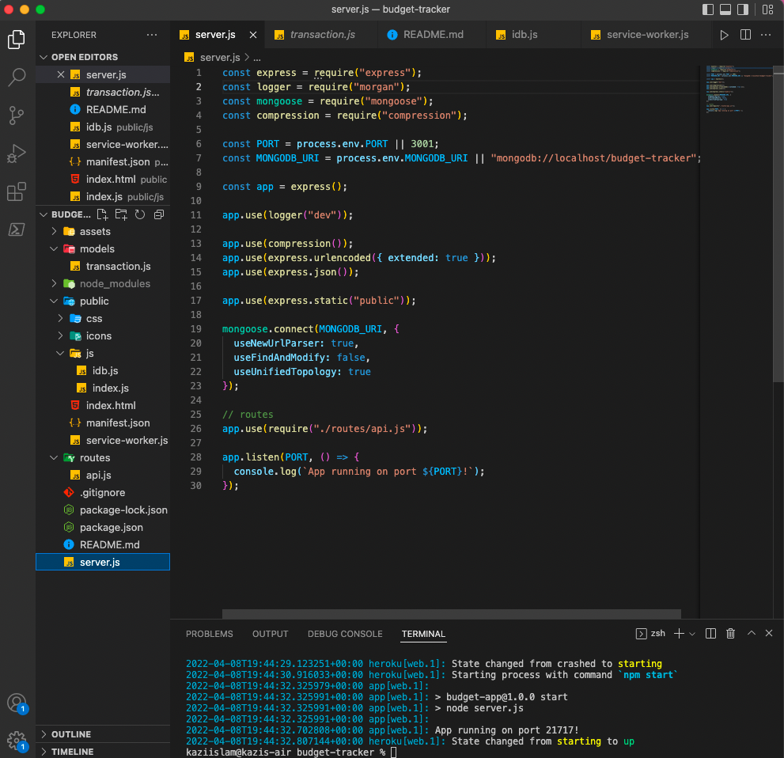
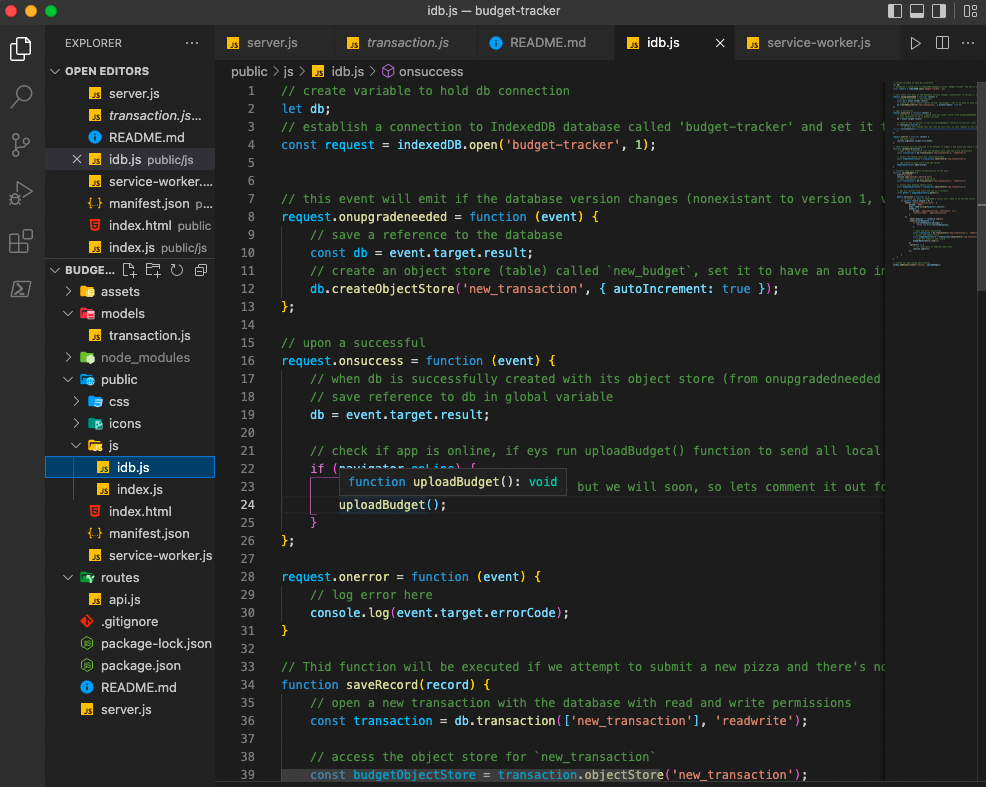
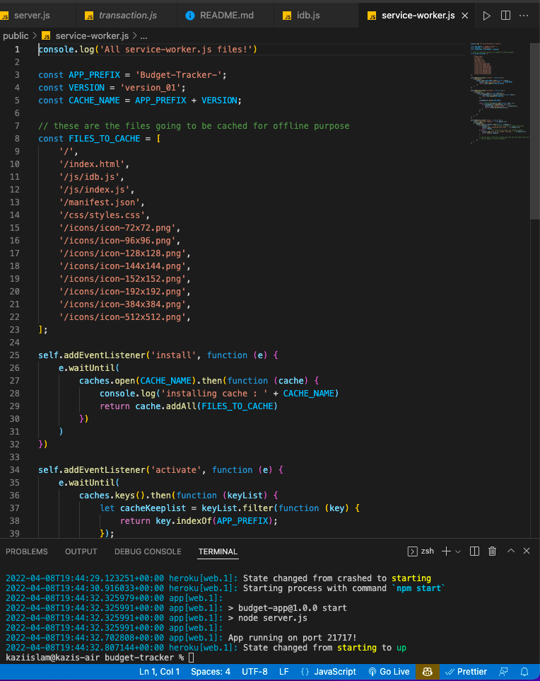
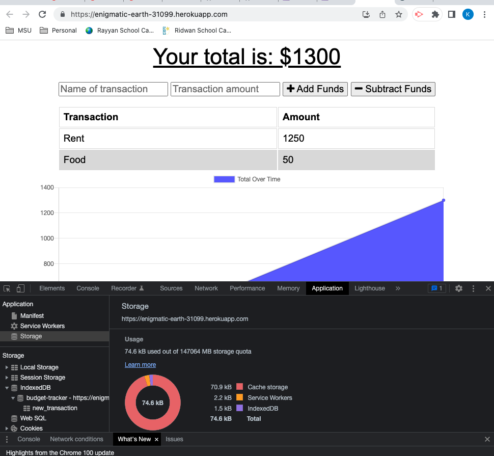
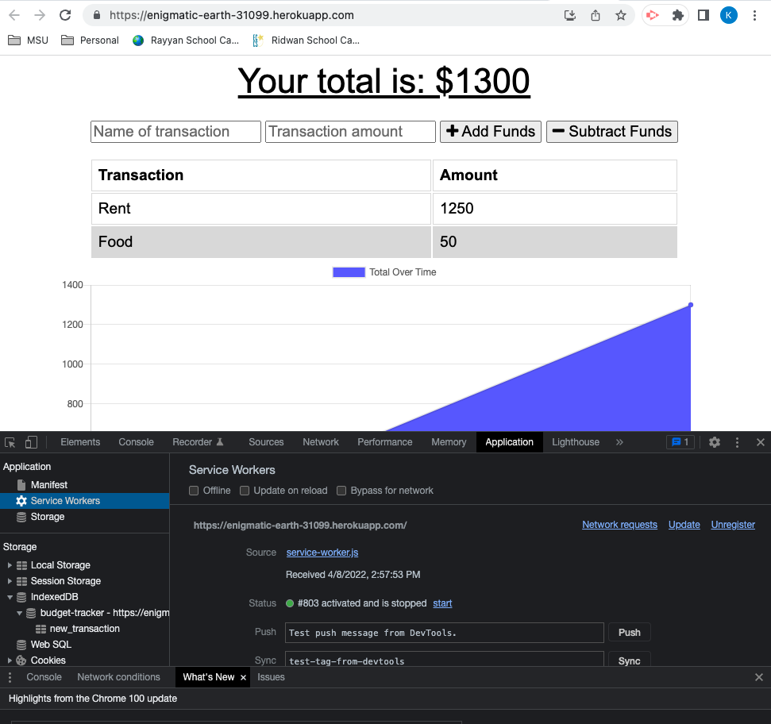
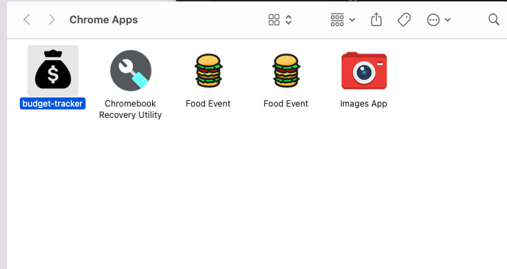

# BUDGET-TRACKER


## Table of contents

1. [Title](#title)
2. [Description](#description)
3. [Installation](#installation)
4. [Usage](#usage)
5. [Contributing](#contributing)
6. [Test](#test)
7. [License](#license)
8. [Questions](#questions)

## Title

BUDGET-TRACKER

## Description

budget tracker application to allow for offline access and functionality. The user will be able to add expenses and deposits to their budget with or without a connection. If the user enters transactions offline, the total should be updated when they're brought back online.

## Acceptance Criteria

```
GIVEN a budget tracker without an internet connection
WHEN the user inputs an expense or deposit
THEN they will receive a notification that they have added an expense or deposit
WHEN the user reestablishes an internet connection
THEN the deposits or expenses added while they were offline are added to their transaction history and their totals are updated
```

## User Story

```
AS AN avid traveler
I WANT to be able to track my withdrawals and deposits with or without a data/internet connection
SO THAT my account balance is accurate when I am traveling
```

## Installation

run `npm install`; which will install all dependend packages

## Usage

to start application run `npm start`

## Contributing

Always create a branch and do PR once ready

## Test

Test on local environment

## License

[MIT](https://gist.github.com/nicolasdao/a7adda51f2f185e8d2700e1573d8a633#mit-license)

## Questions

Do not have any question at this time<br />
Find me on Github [kazichaska](https://github.com/kazichaska)<br />
Email me with any question: kazichaska@gmail.com <br />

## Deployed Application on Heroku

https://enigmatic-earth-31099.herokuapp.com/

## Screenshots of the code

</br>
</br>
</br>
</br>
</br>
</br>
